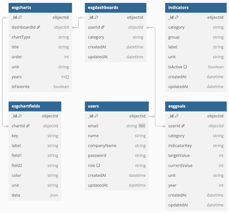

# NNMM - ESG 분석 및 통합 대시보드

Next.js, Nest.js, MongoDB, Mongoose를 기반으로 한 ESG 데이터 시각화 및 관리 플랫폼입니다.

## 프로젝트 개요

- 프로젝트 명: NNMM (Next.js + Nest.js + MongoDB + Mongoose)
- 개발 기간: 2025.03.24 ~ 2025.04.07
- 팀원 및 역할:
  - 김동환: Backend, Frontend, Design
  - 김지현: Backend, Frontend, Design
  - 정상진: Backend, Frontend, Design

---

### 프로젝트 요약문

NNMM은 ESG(Environmental, Social, Governance) 데이터를 통합적으로 수집·관리하고, 이를 시각화하여 한눈에 파악할 수 있도록 지원하는 ESG 분석 대시보드 플랫폼입니다.  
Next.js, NestJS, MongoDB, Mongoose 기반으로 구현된 본 시스템은 사용자 맞춤형 차트 설정, 목표 지표 관리, 자동 시각화 추천 기능 등을 통해 기업의 ESG 경영 활동을 디지털화하고 데이터 기반의 의사결정을 지원합니다.  
유연한 데이터 구조와 직관적인 UI를 통해 ESG 정보를 쉽게 기록하고 추적할 수 있으며, 모든 변경 내역은 이력으로 관리되어 투명하고 신뢰성 있는 ESG 관리 환경을 제공합니다.

---

### 프로젝트 목적

- ESG 데이터의 디지털화 및 시각화
- 유연하고 확장 가능한 ESG 관리 시스템 구축
- 지표 기반 목표 설정 및 성과 추적 기능 제공
- 자동화된 차트 생성 및 추천 기능 도입

---

### 기대 효과

- ESG 경영 활성화 지원
- 데이터 기반 의사결정 강화
- 사용자 맞춤형 대시보드 경험 제공
- 장기적으로 기업의 지속가능성 제고

---

## 사용 기술 스택

- Frontend: Next.js, TypeScript, TailwindCSS
- Backend: NestJS, TypeScript
- Database: MongoDB, Mongoose
- 기타: Chart.js, Recharts 등 시각화 라이브러리

---

## 주요 기능

- ESG 데이터(환경, 사회, 지배구조) 입력 및 관리
- 통합 대시보드에서 차트 생성 및 커스터마이징 (색상, 라벨 등 설정)
- 지표별 목표 설정 기능
- 데이터 변경 이력 추적 (Audit Log)
- 차트 자동 생성 및 추천 기능

---

## 플로우 차트 및 시스템 다이어그램

### 1. 유스케이스 다이어그램

사용자의 주요 활동과 기능 간의 관계를 나타낸 다이어그램입니다.

- 회원 기능: 로그인, 회원가입, 아이디/비밀번호 찾기
- ESG 대시보드: 데이터 입력, 차트 저장/추천/커스터마이징

---

### 2. ERD(Entity Relationship Diagram)

MongoDB 기반의 컬렉션 및 필드 구조를 표현한 ERD입니다.  
사용자, ESG 리포트, 차트, 목표 설정, 지표 관리 등 핵심 구조를 포함합니다.

---

### 3. 로그인 플로우

사용자 인증 및 JWT 발급 과정을 나타낸 흐름도입니다.

---

### 4. 회원가입 플로우

유효성 검사, 이메일 중복 확인, 가입 요청까지의 흐름을 포함합니다.

---

### 5. 데이터 입력 및 차트 생성 흐름

---

### 6. 지표 목표 설정 플로우

카테고리 선택 → 차트 구성 → 목표 설정 및 진행률 시각화까지의 전체 흐름입니다.

---

### 7. 차트 수정/삭제 플로우

사용자가 차트를 수정 또는 삭제하는 전체 과정입니다.

---
